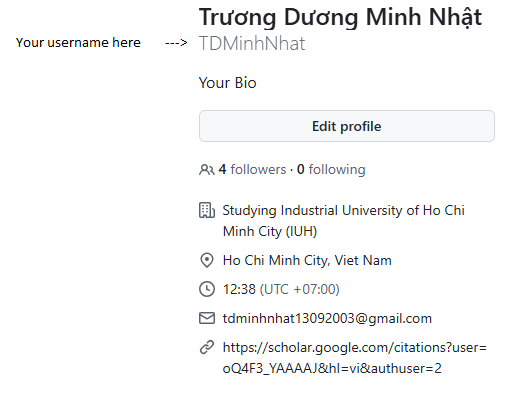

# 👩‍💻 Development Guidelines for Generate Database Library

Welcome! This document outlines the **rules and structure** for developing and contributing to the `generate-database-library` project.

Please follow these standards to ensure clean, consistent, and maintainable code.

---

# 🚀 Getting Started: Contribute and Develop Your Topics

Welcome! This guide helps you **fork the repository**, **create your own development branch**, and **develop your database entities** inside your assigned package.

---

## 1️⃣ Fork the Repository

- Go to the GitHub repo: [generate-database-library](https://github.com/TDMinhNhat/generate-database-library)
- Click **Fork** (top-right corner) to create your own copy.

---

## 2️⃣ Clone Your Fork Locally

```bash
git clone https://github.com/YOUR_GITHUB_USERNAME/generate-database-library.git
cd generate-database-library
```
Replace YOUR_GITHUB_USERNAME with your actual GitHub username.

3️⃣ Create Your Own Development Branch
Create a new branch for your work to keep changes isolated:


```bash
Copy code
git checkout -b feature/[your-username]
```

Example: `git checkout -b feature/tdminhnhat`

# 🧱 Development Rules

✅ Follow Java 21+ (or your project version).

✅ Use Maven for build and dependency management.

✅ Follow Java conventions (use camelCase, PascalCase, etc.).

❌ Do not commit commented-out code.

❌ Avoid hardcoding values. Use configs or constants.

✅ Write Javadoc for all public classes and methods.

---

# 📁 Project Structure

You just only aware only the package "io.github.tdminhnhat.entity.users", this package will be a place where you can develop the topics for yourself and everyone using. The structure project that includes the entity like below:

```
├── src
|     ├── main
|     |     ├── java
|     |     |     ├── io
|     |     |     |     ├── github
|     |     |     |     |     ├── tdminhnhat
|     |     |     |     |     |     ├── entity
|     |     |     |     |     |     |     ├── AbstractEntityProperty.java (<-- With default properties you can use it, but don't overwrite or change anything also this path package is default)
|     |     |     |     |     |     |     |
|     |     |     |     |     |     |     ├── topics (<-- This is list default topics inside, don't aware)
|     |     |     |     |     |     |     |
|     |     |     |     |     |     |     ├── users (<-- Every user who want to develop create a username follow github username inside it)
|     |     |     |     |     |     |     |     |
|     |     |     |     |     |     |     |     ├── example (<-- Username - just example to let you know structure)
|     |     |     |     |     |     |     |     |     |
|     |     |     |     |     |     |     |     |     ├── department (<-- The topic name)
|     |     |     |     |     |     |     |     |     |     ├── (classes 'department' in here)
|     |     |     |     |     |     |     |     |     |     |
|     |     |     |     |     |     |     |     |     |     ├── enums
|     |     |     |     |     |     |     |     |     |          ├── (enums 'department' in here)
|     |     |     |     |     |     |     |     |     |
|     |     |     |     |     |     |     |     |     ├── product (<-- The topic name)
|     |     |     |     |     |     |     |     |     |     ├── (classes 'product' in here)
|     |     |     |     |     |     |     |     |     |     |
|     |     |     |     |     |     |     |     |     |     ├── enums
|     |     |     |     |     |     |     |     |     |          ├── (enums of 'product' in here)
|     |     |     |     |     |     |     |     |     |
|     |     |     |     |     |     |     |     ├── tdminhnhat (<-- Username from Github)
|     |     |     |     |     |     |     |     |     |
|     |     |     |     |     |     |     |     |     ├── hospital_management (<-- The topic name)
|     |     |     |     |     |     |     |     |     |     ├── (classes 'hospital_management' in here)
|     |     |     |     |     |     |     |     |     |     |
|     |     |     |     |     |     |     |     |     |     ├── enums
|     |     |     |     |     |     |     |     |     |          ├── (enums of 'hospital_management' in here)
```

# 💡 Usage

Like mentioned above, you must only develop inside the package: `io.github.tdminhnhat.entity`.

If you don't know your username, refer to the image below. Otherwise, you can skip this step:

<div style="width: 100%; display: flex; align-items: center; justify-content: center">



</div>

---

### 📦 Create Your Own User Package

Once you know your GitHub username (e.g., **TDMinhNhat**), use it to create your personal package following this rule: `io.github.tdminhnhat.entity.users.[your_username_in_lowercase]`

#### ✅ Example

If your GitHub username is `TDMinhNhat`, then your package should be: `io.github.tdminhnhat.entity.users.tdminhnhat`

> 🔔 **Note**: The package name must be **all lowercase**, even if your GitHub username contains uppercase letters.

### 🧱 Create Your Topics

Inside your personal package, you can organize your topics as sub-packages. Each topic should be a new package under your username package:

```
io.github.tdminhnhat.entity.users.tdminhnhat.hospital
io.github.tdminhnhat.entity.users.tdminhnhat.warehouse
io.github.tdminhnhat.entity.users.tdminhnhat.business
```
In the example above, the user `tdminhnhat` has created 3 topics: `hospital`, `warehouse`, and `business`.

### 🧩 Add Your Entities

Within each topic package, you can now create your **entity classes** that will be mapped to the database.

If you have enums related to a topic, you may:

- Create a separate `enums` package:

- Or simply place enums alongside the entities — both approaches are acceptable.

### ✅ Final Step: Test Your Topics

Once your topics, entities, and (optional) enums are created, the final step is to **test** your setup to ensure your entities can be properly **generated and mapped** to the database.

This test is required **before publishing** your entities for public use.

### ⚙️ Example the result

```
generate-database-library/
└── src/
    └── main/
        └── java/
            └── io/
                └── github/
                    └── tdminhnhat/
                        └── entity/
                            └── users/
                                └── tdminhnhat/           <-- 👤 Your username in lowercase
                                    ├── hospital/         <-- 🏥 A topic
                                    │   ├── Patient.java
                                    │   ├── Doctor.java
                                    │   └── enums/
                                    │       └── Gender.java
                                    │
                                    ├── warehouse/        <-- 📦 Another topic
                                    │   ├── Product.java
                                    │   └── Stock.java
                                    │
                                    └── business/         <-- 💼 Another topic
                                        ├── Company.java
                                        └── Employee.java
```